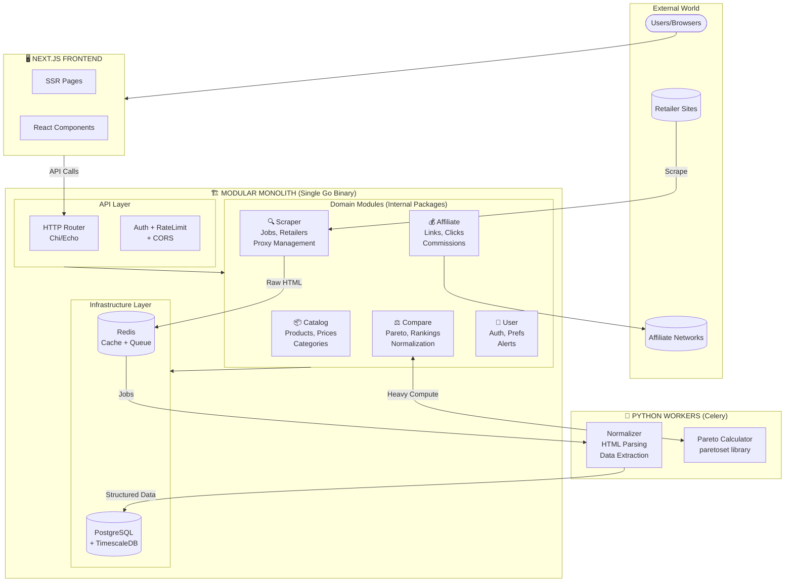
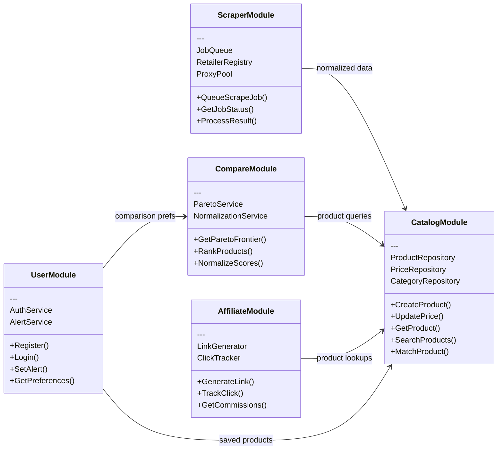
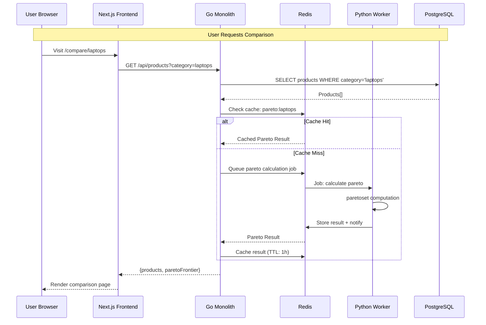
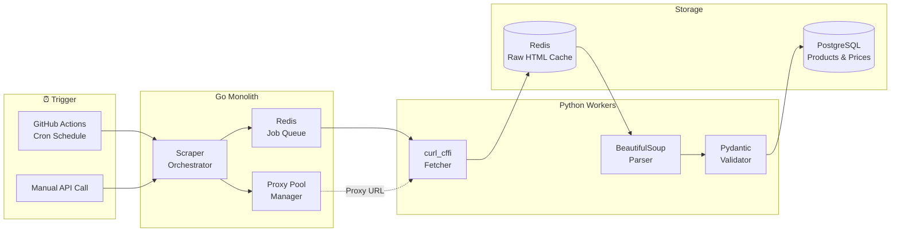
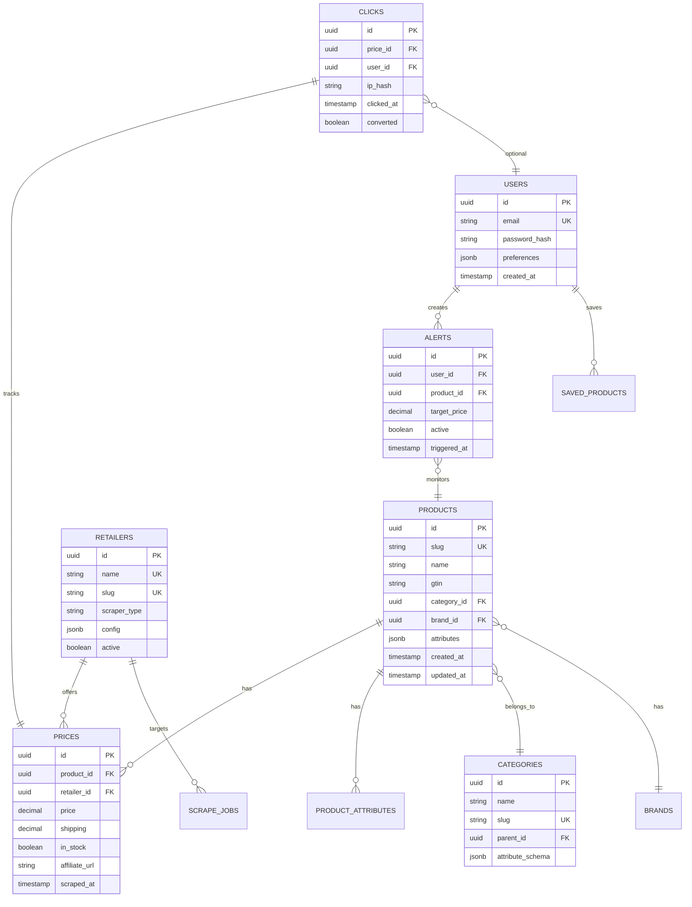
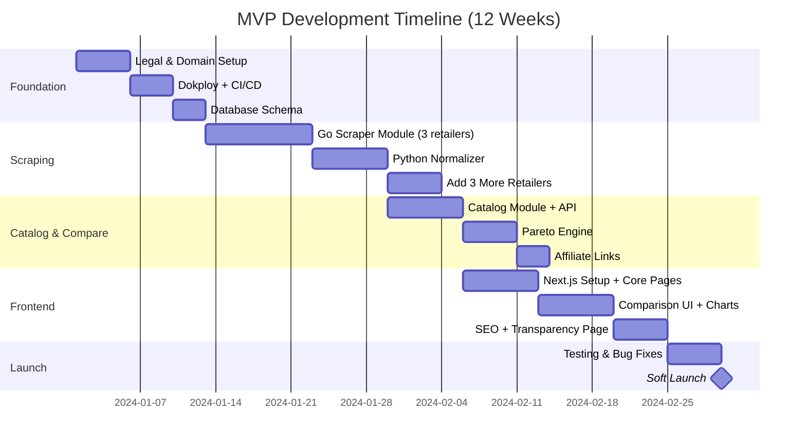
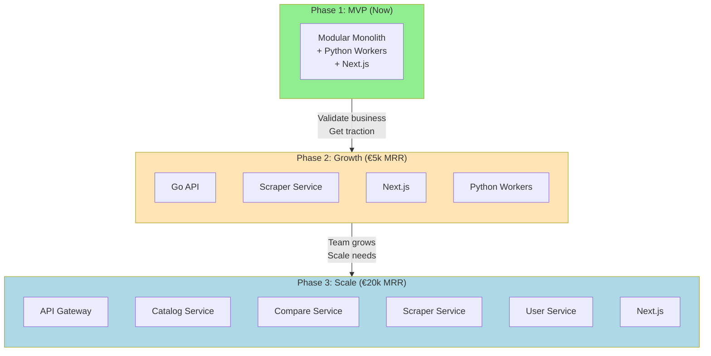

# Architecture Documentation v2

## Modular Monolith for MVP — YAGNI-First Design

---

## Why NOT Microservices for MVP

| Microservices Problem          | Impact on Solo Dev                          |
| ------------------------------ | ------------------------------------------- |
| 9 containers to deploy/monitor | Hours lost on ops instead of features       |
| Inter-service network calls    | Debugging nightmare, added latency          |
| Distributed transactions       | Complex saga patterns for simple operations |
| Multiple repos/packages        | Context switching overhead                  |
| Service discovery              | Infrastructure you don't need yet           |

**The Right Approach**: Start with a **Modular Monolith** — clean internal boundaries that CAN become microservices later, but deployed as 2-3 services maximum.

---

## Simplified Architecture (MVP)



---

## Service Count: 3 (Not 9)

| Service            | Language | Responsibility                                     | Why Separate?                                             |
| ------------------ | -------- | -------------------------------------------------- | --------------------------------------------------------- |
| **Monolith API**   | Go       | All business logic, API, scraping orchestration    | Single binary, fast, type-safe                            |
| **Python Workers** | Python   | HTML parsing, ML normalization, Pareto computation | Needs Python libraries (BeautifulSoup, paretoset, pandas) |
| **Frontend**       | Next.js  | SSR, React UI                                      | Different runtime, SSR requirements                       |

**Total Containers**: 5 (Monolith + Workers + Frontend + PostgreSQL + Redis)

---

## Module Boundaries (Internal to Monolith)



---

## Directory Structure (Go Monolith)

```
comparateur/
├── cmd/
│   └── server/
│       └── main.go                 # Entry point
├── internal/
│   ├── catalog/                    # 📦 Catalog Module
│   │   ├── domain/
│   │   │   ├── product.go          # Entity
│   │   │   ├── price.go            # Entity
│   │   │   └── category.go         # Entity
│   │   ├── repository/
│   │   │   ├── interface.go        # Port (interface)
│   │   │   └── postgres.go         # Adapter (implementation)
│   │   ├── service/
│   │   │   └── catalog.go          # Use cases
│   │   └── handler/
│   │       └── http.go             # HTTP handlers
│   │
│   ├── scraper/                    # 🔍 Scraper Module
│   │   ├── domain/
│   │   │   ├── job.go
│   │   │   └── retailer.go
│   │   ├── adapters/
│   │   │   ├── amazon.go           # Retailer-specific
│   │   │   ├── fnac.go
│   │   │   └── cdiscount.go
│   │   ├── service/
│   │   │   ├── orchestrator.go
│   │   │   └── proxy.go
│   │   └── handler/
│   │       └── http.go
│   │
│   ├── compare/                    # ⚖️ Compare Module
│   │   ├── domain/
│   │   │   └── comparison.go
│   │   ├── service/
│   │   │   ├── pareto.go           # Delegates heavy compute to Python
│   │   │   └── ranking.go
│   │   └── handler/
│   │       └── http.go
│   │
│   ├── affiliate/                  # 💰 Affiliate Module
│   │   ├── domain/
│   │   │   ├── link.go
│   │   │   └── click.go
│   │   ├── service/
│   │   │   └── tracking.go
│   │   └── handler/
│   │       └── http.go
│   │
│   ├── user/                       # 👤 User Module
│   │   ├── domain/
│   │   │   ├── user.go
│   │   │   └── alert.go
│   │   ├── service/
│   │   │   ├── auth.go
│   │   │   └── alerts.go
│   │   └── handler/
│   │       └── http.go
│   │
│   └── shared/                     # 🔧 Shared Infrastructure
│       ├── database/
│       │   └── postgres.go
│       ├── cache/
│       │   └── redis.go
│       ├── queue/
│       │   └── redis.go
│       └── config/
│           └── config.go
│
├── pkg/                            # Public packages (if needed)
│   └── httputil/
│       └── response.go
│
├── migrations/
│   └── 001_initial.sql
├── docker-compose.yml
├── Dockerfile
├── Makefile
└── go.mod
```

---

## Python Workers Structure

```
workers/
├── src/
│   ├── normalizer/
│   │   ├── __init__.py
│   │   ├── parser.py               # BeautifulSoup parsing
│   │   ├── extractors/
│   │   │   ├── amazon.py
│   │   │   ├── fnac.py
│   │   │   └── cdiscount.py
│   │   └── validator.py
│   │
│   ├── pareto/
│   │   ├── __init__.py
│   │   ├── calculator.py           # paretoset integration
│   │   └── normalizer.py           # z-score normalization
│   │
│   └── tasks/
│       ├── __init__.py
│       └── celery_app.py
│
├── tests/
├── requirements.txt
├── Dockerfile
└── pyproject.toml
```

---

## Communication Pattern (Simplified)



---

## Data Flow (Scraping Pipeline)



---

## When to Split into Microservices

**Don't split until you have ALL of these:**

| Trigger                | Threshold                                      | Action                               |
| ---------------------- | ---------------------------------------------- | ------------------------------------ |
| Team size              | >3 developers                                  | Consider splitting by team ownership |
| Deploy frequency       | Different modules need different deploy cycles | Split the bottleneck                 |
| Scale requirements     | One module needs 10x more resources            | Extract to scale independently       |
| Revenue validation     | >€5k MRR                                       | Business validated, invest in infra  |
| Performance bottleneck | Profiling shows clear module boundary          | Extract hot path                     |

**Until then**: Keep the monolith, enjoy simple deployments, fast debugging, and single-process transactions.

---

## Database Schema (Single PostgreSQL)



---

## MVP Feature Scope (YAGNI Applied)

### ✅ MVP (Weeks 1-16)

| Feature                        | Included | Rationale         |
| ------------------------------ | -------- | ----------------- |
| Product scraping (6 retailers) | ✅       | Core value        |
| Price comparison table         | ✅       | Core value        |
| Pareto frontier visualization  | ✅       | Differentiator    |
| Affiliate link tracking        | ✅       | Revenue           |
| Basic search/filter            | ✅       | Usability         |
| Price history charts           | ✅       | User value        |
| SEO (Schema.org, SSR)          | ✅       | Acquisition       |
| Transparency page              | ✅       | Legal requirement |

### ❌ NOT in MVP (Add Later If Validated)

| Feature                | Excluded | Add When                  |
| ---------------------- | -------- | ------------------------- |
| User accounts          | ❌       | After 1000 MAU            |
| Price alerts           | ❌       | After user accounts       |
| Email notifications    | ❌       | After price alerts        |
| Mobile app             | ❌       | After €10k MRR            |
| Multi-language         | ❌       | After France validated    |
| Banking/SaaS verticals | ❌       | After hardware validated  |
| Admin dashboard        | ❌       | Use SQL directly          |
| A/B testing            | ❌       | After significant traffic |

---

## Revised Timeline (Simpler = Faster)



**Result**: 12 weeks instead of 16, with less complexity and clearer focus.

---

## Evolution Path (If Business Succeeds)



---

## Key Takeaways

1. **Start with 3 services max**: Go Monolith + Python Workers + Frontend
2. **Use internal packages** as module boundaries (not network boundaries)
3. **Same database** for all modules (PostgreSQL)
4. **Split only when forced** by team size, scale, or deploy needs
5. **YAGNI everything** — no user accounts, no alerts, no admin until validated
6. **12 weeks** is achievable with this simplified architecture

---

_"The best architecture is the one that lets you ship and iterate fastest."_
