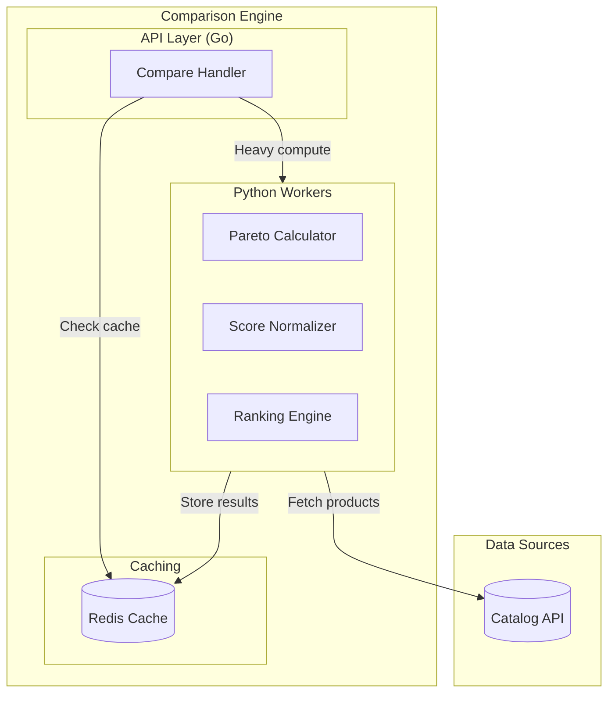
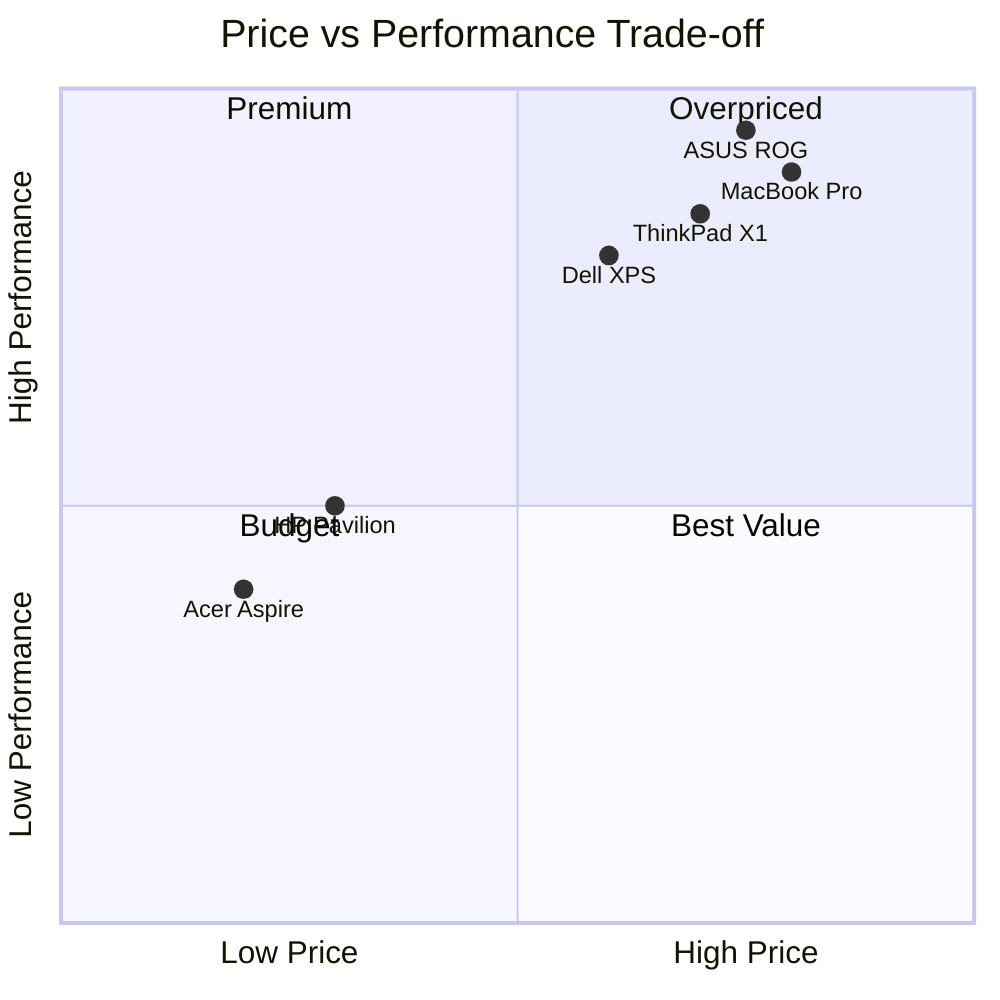
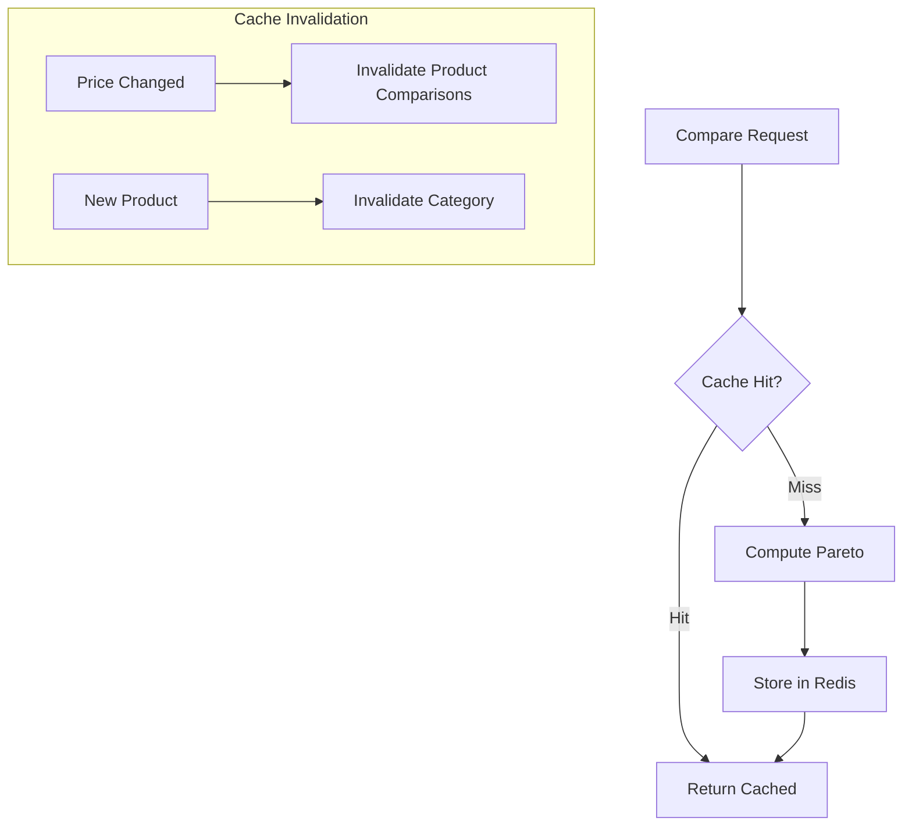
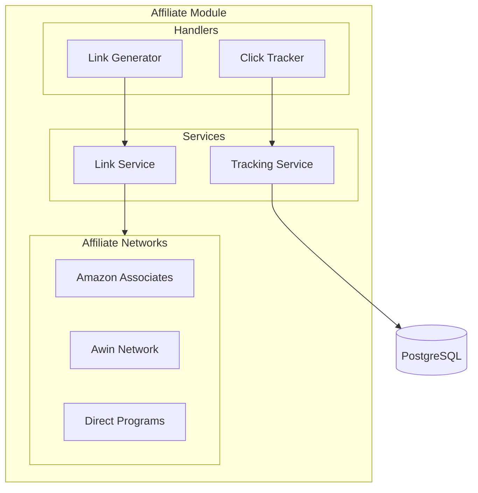

# Comparison Engine & Affiliate Module

## Pareto Optimization, Rankings & Revenue Generation

---

## Module Overview

| Module         | Language | Location              | Responsibility                  |
| -------------- | -------- | --------------------- | ------------------------------- |
| **Comparison** | Python   | `workers/src/pareto/` | Pareto frontier, rankings       |
| **Affiliate**  | Go       | `internal/affiliate/` | Link generation, click tracking |

---

## Comparison Engine Architecture



---

## Pareto Optimization Explained

### The Problem

Users don't just want the **cheapest** laptop. They want the **best value** considering:

- Price (minimize)
- Performance (maximize)
- Battery life (maximize)
- Weight (minimize)
- Screen quality (maximize)

No single product wins on ALL dimensions. The **Pareto Frontier** shows all products that are "equally optimal" — no other product beats them in every category.



Products on the **Pareto Frontier**: MacBook Pro, ThinkPad X1, Dell XPS, HP Pavilion, Acer Aspire (the outer edge where no product dominates another).

---

## Milestones

### S4-M1: Pareto Algorithm (3 days)

**Goal**: Implement Pareto frontier calculation

**Pareto Calculator** (`workers/src/pareto/calculator.py`):

```python
"""
Pareto frontier calculation using paretoset library
Efficient O(n log n) for 2 objectives, O(n^2) for more
"""
import numpy as np
from paretoset import paretoset
from typing import Optional
from dataclasses import dataclass
from enum import Enum


class ObjectiveSense(Enum):
    MINIMIZE = "min"  # Lower is better (price, weight)
    MAXIMIZE = "max"  # Higher is better (performance, battery)


@dataclass
class Objective:
    name: str
    sense: ObjectiveSense
    weight: float = 1.0  # For weighted scoring


@dataclass
class ComparisonRequest:
    product_ids: list[str]
    objectives: list[Objective]
    limit: Optional[int] = None


@dataclass
class ParetoResult:
    pareto_ids: list[str]  # Products on the frontier
    dominated_ids: list[str]  # Products NOT on frontier
    scores: dict[str, float]  # Utility scores per product
    frontier_data: list[dict]  # Data for visualization


class ParetoCalculator:
    """
    Calculate Pareto frontier for multi-objective comparison
    """

    def calculate(
        self,
        products: list[dict],
        objectives: list[Objective]
    ) -> ParetoResult:
        """
        Find Pareto-optimal products

        Args:
            products: List of product dicts with objective values
            objectives: List of objectives to optimize

        Returns:
            ParetoResult with frontier products and scores
        """
        if len(products) < 2:
            return ParetoResult(
                pareto_ids=[p['id'] for p in products],
                dominated_ids=[],
                scores={p['id']: 1.0 for p in products},
                frontier_data=[]
            )

        # Build objective matrix
        n_products = len(products)
        n_objectives = len(objectives)

        data = np.zeros((n_products, n_objectives))

        for i, product in enumerate(products):
            for j, obj in enumerate(objectives):
                value = product.get(obj.name, 0)
                # Normalize direction: paretoset assumes all maximize
                if obj.sense == ObjectiveSense.MINIMIZE:
                    value = -value  # Flip for minimization
                data[i, j] = value

        # Find Pareto frontier
        # sense=["max"] * n_objectives because we flipped minimization objectives
        mask = paretoset(data, sense=["max"] * n_objectives)

        pareto_ids = []
        dominated_ids = []

        for i, product in enumerate(products):
            if mask[i]:
                pareto_ids.append(product['id'])
            else:
                dominated_ids.append(product['id'])

        # Calculate utility scores (weighted sum of normalized values)
        scores = self._calculate_scores(products, objectives)

        # Build frontier data for visualization
        frontier_data = self._build_frontier_data(
            products, objectives, mask, scores
        )

        return ParetoResult(
            pareto_ids=pareto_ids,
            dominated_ids=dominated_ids,
            scores=scores,
            frontier_data=frontier_data
        )

    def _calculate_scores(
        self,
        products: list[dict],
        objectives: list[Objective]
    ) -> dict[str, float]:
        """
        Calculate weighted utility score for each product
        Using z-score normalization for fair comparison
        """
        scores = {}

        # Gather values per objective
        objective_values = {obj.name: [] for obj in objectives}
        for product in products:
            for obj in objectives:
                objective_values[obj.name].append(
                    product.get(obj.name, 0)
                )

        # Calculate z-scores
        z_scores = {}
        for obj in objectives:
            values = np.array(objective_values[obj.name])
            mean = values.mean()
            std = values.std()
            if std == 0:
                std = 1  # Avoid division by zero

            z_scores[obj.name] = (values - mean) / std

            # Flip sign for minimization objectives
            if obj.sense == ObjectiveSense.MINIMIZE:
                z_scores[obj.name] = -z_scores[obj.name]

        # Weighted sum
        total_weight = sum(obj.weight for obj in objectives)

        for i, product in enumerate(products):
            score = 0
            for obj in objectives:
                score += (obj.weight / total_weight) * z_scores[obj.name][i]

            # Normalize to 0-100 scale
            scores[product['id']] = float(score)

        # Rescale to 0-100
        min_score = min(scores.values())
        max_score = max(scores.values())
        score_range = max_score - min_score if max_score != min_score else 1

        for pid in scores:
            scores[pid] = ((scores[pid] - min_score) / score_range) * 100

        return scores

    def _build_frontier_data(
        self,
        products: list[dict],
        objectives: list[Objective],
        pareto_mask: np.ndarray,
        scores: dict[str, float]
    ) -> list[dict]:
        """Build data structure for frontend visualization"""
        frontier_data = []

        for i, product in enumerate(products):
            point = {
                'id': product['id'],
                'name': product.get('name', ''),
                'is_pareto': bool(pareto_mask[i]),
                'score': scores[product['id']],
                'objectives': {}
            }

            for obj in objectives:
                point['objectives'][obj.name] = {
                    'value': product.get(obj.name, 0),
                    'sense': obj.sense.value
                }

            frontier_data.append(point)

        return frontier_data


# Celery task wrapper
from celery import shared_task

@shared_task
def calculate_pareto_frontier(
    products: list[dict],
    objectives: list[dict]
) -> dict:
    """Celery task for Pareto calculation"""
    calc = ParetoCalculator()

    obj_list = [
        Objective(
            name=o['name'],
            sense=ObjectiveSense(o['sense']),
            weight=o.get('weight', 1.0)
        )
        for o in objectives
    ]

    result = calc.calculate(products, obj_list)

    return {
        'pareto_ids': result.pareto_ids,
        'dominated_ids': result.dominated_ids,
        'scores': result.scores,
        'frontier_data': result.frontier_data
    }
```

**Unit Tests** (`workers/tests/test_pareto.py`):

```python
import pytest
from src.pareto.calculator import ParetoCalculator, Objective, ObjectiveSense


def test_simple_pareto():
    """Test basic 2-objective Pareto frontier"""
    calc = ParetoCalculator()

    products = [
        {'id': 'A', 'price': 100, 'performance': 80},  # Pareto
        {'id': 'B', 'price': 150, 'performance': 90},  # Pareto
        {'id': 'C', 'price': 120, 'performance': 70},  # Dominated by A
        {'id': 'D', 'price': 200, 'performance': 95},  # Pareto
    ]

    objectives = [
        Objective('price', ObjectiveSense.MINIMIZE),
        Objective('performance', ObjectiveSense.MAXIMIZE),
    ]

    result = calc.calculate(products, objectives)

    assert set(result.pareto_ids) == {'A', 'B', 'D'}
    assert result.dominated_ids == ['C']


def test_weighted_scores():
    """Test that weights affect final scores"""
    calc = ParetoCalculator()

    products = [
        {'id': 'A', 'price': 500, 'performance': 90},
        {'id': 'B', 'price': 300, 'performance': 60},
    ]

    # Equal weights
    objectives_equal = [
        Objective('price', ObjectiveSense.MINIMIZE, weight=1.0),
        Objective('performance', ObjectiveSense.MAXIMIZE, weight=1.0),
    ]
    result_equal = calc.calculate(products, objectives_equal)

    # Price-focused weights
    objectives_price = [
        Objective('price', ObjectiveSense.MINIMIZE, weight=3.0),
        Objective('performance', ObjectiveSense.MAXIMIZE, weight=1.0),
    ]
    result_price = calc.calculate(products, objectives_price)

    # B should score higher with price-focused weights
    assert result_price.scores['B'] > result_price.scores['A']
```

**Deliverables**:

- [ ] Pareto calculation with paretoset
- [ ] Z-score normalization
- [ ] Weighted scoring
- [ ] Unit tests
- [ ] Celery task integration

---

### S4-M2: Ranking API (2 days)

**Goal**: HTTP endpoints for comparisons

**API Endpoints**:

| Method | Path                          | Description                      |
| ------ | ----------------------------- | -------------------------------- |
| POST   | `/api/compare`                | Get Pareto frontier for products |
| GET    | `/api/compare/category/:slug` | Pre-computed category comparison |

**Compare Handler** (Go - delegates to Python):

```go
// internal/catalog/handler/compare.go
package handler

import (
    "context"
    "encoding/json"
    "net/http"
    "time"

    "github.com/go-chi/chi/v5"
    "github.com/redis/go-redis/v9"
)

type CompareHandler struct {
    redis      *redis.Client
    catalogSvc *service.CatalogService
}

type CompareRequest struct {
    ProductIDs []string            `json:"product_ids"`
    Objectives []ObjectiveConfig   `json:"objectives"`
}

type ObjectiveConfig struct {
    Name   string  `json:"name"`
    Sense  string  `json:"sense"`  // "min" or "max"
    Weight float64 `json:"weight"`
}

func (h *CompareHandler) Compare(w http.ResponseWriter, r *http.Request) {
    ctx := r.Context()

    var req CompareRequest
    if err := json.NewDecoder(r.Body).Decode(&req); err != nil {
        http.Error(w, "Invalid request", http.StatusBadRequest)
        return
    }

    // Check cache first
    cacheKey := h.buildCacheKey(req)
    cached, err := h.redis.Get(ctx, cacheKey).Result()
    if err == nil {
        w.Header().Set("Content-Type", "application/json")
        w.Header().Set("X-Cache", "HIT")
        w.Write([]byte(cached))
        return
    }

    // Fetch product data
    products, err := h.catalogSvc.GetProductsWithPrices(ctx, req.ProductIDs)
    if err != nil {
        http.Error(w, err.Error(), http.StatusInternalServerError)
        return
    }

    // Call Python worker for Pareto calculation
    result, err := h.callParetoWorker(ctx, products, req.Objectives)
    if err != nil {
        http.Error(w, err.Error(), http.StatusInternalServerError)
        return
    }

    // Cache result
    resultJSON, _ := json.Marshal(result)
    h.redis.Set(ctx, cacheKey, resultJSON, 1*time.Hour)

    w.Header().Set("Content-Type", "application/json")
    w.Header().Set("X-Cache", "MISS")
    w.Write(resultJSON)
}

func (h *CompareHandler) callParetoWorker(
    ctx context.Context,
    products []map[string]interface{},
    objectives []ObjectiveConfig,
) (map[string]interface{}, error) {
    // Use Redis pub/sub to call Python worker
    // Or use HTTP call to FastAPI service

    taskData := map[string]interface{}{
        "products":   products,
        "objectives": objectives,
    }

    taskJSON, _ := json.Marshal(taskData)

    // Publish task
    h.redis.Publish(ctx, "pareto:calculate", taskJSON)

    // Wait for result (simple blocking - improve with proper async)
    sub := h.redis.Subscribe(ctx, "pareto:result")
    defer sub.Close()

    select {
    case msg := <-sub.Channel():
        var result map[string]interface{}
        json.Unmarshal([]byte(msg.Payload), &result)
        return result, nil
    case <-time.After(10 * time.Second):
        return nil, fmt.Errorf("pareto calculation timeout")
    }
}
```

**Deliverables**:

- [ ] Compare endpoint
- [ ] Category-level pre-computation
- [ ] Go-Python communication via Redis
- [ ] Response caching

---

### S4-M3: Caching Strategy (2 days)

**Goal**: Sub-50ms response for cached comparisons



**Cache Keys**:

```
# Product-level comparison (specific products)
pareto:products:{sorted_product_ids_hash}:{objectives_hash}

# Category-level (all laptops, default objectives)
pareto:category:{category_slug}:default

# Category with custom objectives
pareto:category:{category_slug}:{objectives_hash}
```

**TTL Strategy**:

| Cache Type         | TTL      | Reason                            |
| ------------------ | -------- | --------------------------------- |
| Product comparison | 1 hour   | Prices change frequently          |
| Category default   | 4 hours  | Larger dataset, slower to compute |
| Price history      | 24 hours | Historical data doesn't change    |

**Deliverables**:

- [ ] Redis caching with appropriate TTLs
- [ ] Cache invalidation on price changes
- [ ] Cache warming for popular categories
- [ ] Metrics on cache hit rate

---

## Affiliate Module

### Architecture



---

### S5-M1: Affiliate Links (3 days)

**Goal**: Generate tracked affiliate URLs

**Link Generator** (`internal/affiliate/service/links.go`):

```go
package service

import (
    "fmt"
    "net/url"
    "strings"
)

type AffiliateNetwork string

const (
    NetworkAmazon AffiliateNetwork = "amazon"
    NetworkAwin   AffiliateNetwork = "awin"
    NetworkDirect AffiliateNetwork = "direct"
)

type AffiliateConfig struct {
    Network     AffiliateNetwork
    TrackingID  string
    MerchantID  string  // For Awin
    SubID       string  // Custom tracking parameter
}

type LinkGenerator struct {
    configs map[string]AffiliateConfig  // retailer_id -> config
}

func NewLinkGenerator() *LinkGenerator {
    return &LinkGenerator{
        configs: map[string]AffiliateConfig{
            "amazon": {
                Network:    NetworkAmazon,
                TrackingID: "votretag-21",  // Amazon Associate tag
            },
            "fnac": {
                Network:    NetworkAwin,
                TrackingID: "123456",       // Awin publisher ID
                MerchantID: "7890",         // Fnac merchant ID in Awin
            },
            "darty": {
                Network:    NetworkAwin,
                TrackingID: "123456",
                MerchantID: "7891",
            },
            "cdiscount": {
                Network:    NetworkAwin,
                TrackingID: "123456",
                MerchantID: "7892",
            },
            "boulanger": {
                Network:    NetworkDirect,
                TrackingID: "votre_id",
            },
            "ldlc": {
                Network:    NetworkDirect,
                TrackingID: "votre_id",
            },
        },
    }
}

func (g *LinkGenerator) GenerateLink(
    retailerID string,
    originalURL string,
    clickID string,  // Internal tracking ID
) (string, error) {
    config, ok := g.configs[retailerID]
    if !ok {
        return originalURL, nil  // No affiliate config, return original
    }

    switch config.Network {
    case NetworkAmazon:
        return g.generateAmazonLink(originalURL, config, clickID)
    case NetworkAwin:
        return g.generateAwinLink(originalURL, config, clickID)
    case NetworkDirect:
        return g.generateDirectLink(originalURL, config, clickID)
    default:
        return originalURL, nil
    }
}

func (g *LinkGenerator) generateAmazonLink(
    originalURL string,
    config AffiliateConfig,
    clickID string,
) (string, error) {
    u, err := url.Parse(originalURL)
    if err != nil {
        return originalURL, err
    }

    // Add Amazon tag parameter
    q := u.Query()
    q.Set("tag", config.TrackingID)
    q.Set("linkCode", "ll1")

    // Add sub-tracking for our analytics
    if clickID != "" {
        q.Set("ref", clickID)
    }

    u.RawQuery = q.Encode()
    return u.String(), nil
}

func (g *LinkGenerator) generateAwinLink(
    originalURL string,
    config AffiliateConfig,
    clickID string,
) (string, error) {
    // Awin deep link format:
    // https://www.awin1.com/cread.php?awinmid=MERCHANT&awinaffid=PUBLISHER&ued=ENCODED_URL

    encodedURL := url.QueryEscape(originalURL)

    awinURL := fmt.Sprintf(
        "https://www.awin1.com/cread.php?awinmid=%s&awinaffid=%s&ued=%s",
        config.MerchantID,
        config.TrackingID,
        encodedURL,
    )

    // Add click tracking
    if clickID != "" {
        awinURL += fmt.Sprintf("&clickref=%s", clickID)
    }

    return awinURL, nil
}

func (g *LinkGenerator) generateDirectLink(
    originalURL string,
    config AffiliateConfig,
    clickID string,
) (string, error) {
    // For direct programs, add UTM parameters
    u, err := url.Parse(originalURL)
    if err != nil {
        return originalURL, err
    }

    q := u.Query()
    q.Set("utm_source", "comparateur")
    q.Set("utm_medium", "affiliate")
    q.Set("utm_campaign", config.TrackingID)
    if clickID != "" {
        q.Set("utm_content", clickID)
    }

    u.RawQuery = q.Encode()
    return u.String(), nil
}
```

**Click Tracking** (`internal/affiliate/handler/click.go`):

```go
package handler

import (
    "net/http"
    "time"

    "github.com/go-chi/chi/v5"
    "github.com/google/uuid"
)

type ClickHandler struct {
    linkGen *service.LinkGenerator
    repo    ports.IClickRepository
}

func (h *ClickHandler) RegisterRoutes(r chi.Router) {
    // Redirect endpoint
    r.Get("/go/{retailer}/{product_id}", h.HandleClick)
}

func (h *ClickHandler) HandleClick(w http.ResponseWriter, r *http.Request) {
    ctx := r.Context()

    retailerID := chi.URLParam(r, "retailer")
    productID := chi.URLParam(r, "product_id")

    // Generate click ID
    clickID := uuid.New().String()[:8]

    // Get original URL from database
    price, err := h.repo.GetLatestPrice(ctx, productID, retailerID)
    if err != nil {
        http.Error(w, "Product not found", http.StatusNotFound)
        return
    }

    // Generate affiliate link
    affiliateURL, _ := h.linkGen.GenerateLink(retailerID, price.URL, clickID)

    // Record click
    click := &domain.Click{
        ID:         clickID,
        ProductID:  productID,
        RetailerID: retailerID,
        UserAgent:  r.UserAgent(),
        IPHash:     hashIP(r.RemoteAddr),  // GDPR: hash IP, don't store raw
        Referer:    r.Referer(),
        ClickedAt:  time.Now(),
    }
    h.repo.SaveClick(ctx, click)

    // 302 redirect to affiliate URL
    http.Redirect(w, r, affiliateURL, http.StatusFound)
}

func hashIP(ip string) string {
    // Hash IP for privacy
    h := sha256.Sum256([]byte(ip + "salt"))
    return hex.EncodeToString(h[:8])
}
```

**Deliverables**:

- [ ] Link generator for Amazon, Awin, direct
- [ ] Click tracking with GDPR-compliant IP hashing
- [ ] Redirect endpoint `/go/{retailer}/{product_id}`
- [ ] Click analytics table
- [ ] Conversion tracking (manual import from networks)

---

### S5-M2: Revenue Tracking (2 days)

**Goal**: Track affiliate performance

**Clicks Table**:

```sql
CREATE TABLE clicks (
    id VARCHAR(8) PRIMARY KEY,
    product_id UUID NOT NULL REFERENCES products(id),
    retailer_id UUID NOT NULL REFERENCES retailers(id),
    user_id UUID REFERENCES users(id),  -- NULL for anonymous
    session_id VARCHAR(36),
    ip_hash VARCHAR(16) NOT NULL,
    user_agent TEXT,
    referer TEXT,
    clicked_at TIMESTAMPTZ NOT NULL DEFAULT NOW()
);

CREATE INDEX idx_clicks_product ON clicks(product_id);
CREATE INDEX idx_clicks_date ON clicks(clicked_at);

-- Daily aggregates for dashboard
CREATE MATERIALIZED VIEW daily_clicks AS
SELECT
    date_trunc('day', clicked_at) as day,
    retailer_id,
    COUNT(*) as click_count,
    COUNT(DISTINCT ip_hash) as unique_visitors
FROM clicks
GROUP BY 1, 2;
```

**Deliverables**:

- [ ] Clicks table with indexes
- [ ] Daily aggregates materialized view
- [ ] Simple analytics API
- [ ] CSV export for reconciliation

---

## Frontend Integration

### Pareto Visualization Component

```typescript
// components/ParetoChart.tsx
'use client';

import { useMemo } from 'react';
import {
  ScatterChart,
  Scatter,
  XAxis,
  YAxis,
  CartesianGrid,
  Tooltip,
  ResponsiveContainer,
  Line,
} from 'recharts';

interface Product {
  id: string;
  name: string;
  price: number;
  performance: number;
  isPareto: boolean;
  score: number;
}

interface ParetoChartProps {
  products: Product[];
  xAxis: string;
  yAxis: string;
}

export function ParetoChart({ products, xAxis, yAxis }: ParetoChartProps) {
  const { paretoProducts, dominatedProducts, frontierLine } = useMemo(() => {
    const pareto = products.filter(p => p.isPareto);
    const dominated = products.filter(p => !p.isPareto);

    // Sort pareto products by x-axis for frontier line
    const sorted = [...pareto].sort((a, b) => a[xAxis] - b[xAxis]);
    const line = sorted.map(p => ({ x: p[xAxis], y: p[yAxis] }));

    return {
      paretoProducts: pareto,
      dominatedProducts: dominated,
      frontierLine: line,
    };
  }, [products, xAxis, yAxis]);

  return (
    <div className="w-full h-96">
      <ResponsiveContainer>
        <ScatterChart margin={{ top: 20, right: 20, bottom: 20, left: 20 }}>
          <CartesianGrid strokeDasharray="3 3" />
          <XAxis
            dataKey={xAxis}
            name={xAxis}
            unit="€"
            type="number"
          />
          <YAxis
            dataKey={yAxis}
            name={yAxis}
            type="number"
          />
          <Tooltip
            cursor={{ strokeDasharray: '3 3' }}
            content={<CustomTooltip />}
          />

          {/* Dominated products (gray) */}
          <Scatter
            name="Autres produits"
            data={dominatedProducts}
            fill="#9CA3AF"
            opacity={0.5}
          />

          {/* Pareto frontier products (blue) */}
          <Scatter
            name="Meilleurs compromis"
            data={paretoProducts}
            fill="#3B82F6"
          />

          {/* Frontier line */}
          <Line
            type="monotone"
            data={frontierLine}
            dataKey="y"
            stroke="#3B82F6"
            strokeWidth={2}
            dot={false}
          />
        </ScatterChart>
      </ResponsiveContainer>

      <div className="flex justify-center gap-4 mt-4">
        <div className="flex items-center gap-2">
          <div className="w-3 h-3 rounded-full bg-blue-500" />
          <span className="text-sm">Meilleurs compromis (Pareto)</span>
        </div>
        <div className="flex items-center gap-2">
          <div className="w-3 h-3 rounded-full bg-gray-400" />
          <span className="text-sm">Autres produits</span>
        </div>
      </div>
    </div>
  );
}

function CustomTooltip({ active, payload }) {
  if (!active || !payload?.length) return null;

  const product = payload[0].payload;

  return (
    <div className="bg-white p-3 rounded-lg shadow-lg border">
      <p className="font-semibold">{product.name}</p>
      <p className="text-sm text-gray-600">Prix: {product.price}€</p>
      <p className="text-sm text-gray-600">Performance: {product.performance}</p>
      <p className="text-sm font-medium text-blue-600">
        Score: {product.score.toFixed(0)}/100
      </p>
    </div>
  );
}
```

---

## Definition of Done

### Comparison Engine

- [ ] Pareto calculation correct for 2+ objectives
- [ ] Z-score normalization working
- [ ] API response <200ms (cached)
- [ ] Cache hit rate >80% for popular queries

### Affiliate Module

- [ ] Links generated for all 6 retailers
- [ ] Click tracking with GDPR compliance
- [ ] Redirect latency <50ms
- [ ] Analytics dashboard data available

---

_Combined Estimated Effort: 12 days_  
_Last Updated: Week 0_
