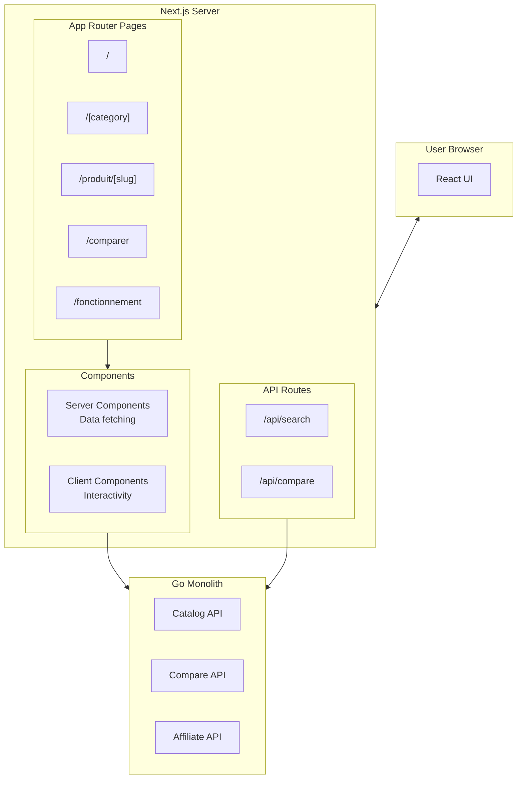
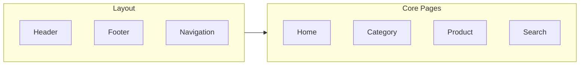

# Frontend Module Specification

## Next.js 14+ SSR/RSC Architecture for SEO & Performance

---

## Module Overview

| Aspect        | Detail                                         |
| ------------- | ---------------------------------------------- |
| **Framework** | Next.js 14+ (App Router)                       |
| **Language**  | TypeScript                                     |
| **Styling**   | Tailwind CSS                                   |
| **State**     | React Server Components + minimal client state |
| **Location**  | `frontend/`                                    |

---

## Architecture



---

## Directory Structure

```
frontend/
├── app/
│   ├── layout.tsx                 # Root layout with nav, footer
│   ├── page.tsx                   # Home page
│   ├── globals.css
│   │
│   ├── [category]/
│   │   ├── page.tsx               # Category listing
│   │   └── [subcategory]/
│   │       └── page.tsx           # Subcategory
│   │
│   ├── produit/
│   │   └── [slug]/
│   │       ├── page.tsx           # Product detail + prices
│   │       └── opengraph-image.tsx
│   │
│   ├── comparer/
│   │   └── page.tsx               # Comparison tool
│   │
│   ├── fonctionnement/
│   │   └── page.tsx               # Transparency (legal requirement)
│   │
│   ├── recherche/
│   │   └── page.tsx               # Search results
│   │
│   └── api/
│       ├── search/route.ts
│       └── compare/route.ts
│
├── components/
│   ├── ui/                        # Shadcn/ui components
│   │   ├── button.tsx
│   │   ├── card.tsx
│   │   └── ...
│   │
│   ├── product/
│   │   ├── ProductCard.tsx        # Server component
│   │   ├── PriceTable.tsx         # Server component
│   │   ├── PriceChart.tsx         # Client component
│   │   └── AffiliateButton.tsx    # Client component (tracking)
│   │
│   ├── comparison/
│   │   ├── ParetoChart.tsx        # Client component
│   │   ├── ObjectiveSliders.tsx   # Client component
│   │   └── ComparisonTable.tsx    # Server component
│   │
│   ├── layout/
│   │   ├── Header.tsx
│   │   ├── Footer.tsx
│   │   ├── Navigation.tsx
│   │   └── SearchBar.tsx
│   │
│   └── seo/
│       ├── JsonLd.tsx
│       └── BreadcrumbJsonLd.tsx
│
├── lib/
│   ├── api.ts                     # API client
│   ├── utils.ts
│   └── constants.ts
│
├── types/
│   ├── product.ts
│   ├── price.ts
│   └── comparison.ts
│
├── public/
│   ├── robots.txt
│   └── sitemap.xml                # Generated
│
├── next.config.js
├── tailwind.config.js
├── tsconfig.json
└── package.json
```

---

## Milestones

### S9-M1: Core Pages & Layout (5 days)

**Goal**: Basic pages with SSR and navigation



**Root Layout** (`app/layout.tsx`):

```tsx
import { Inter } from "next/font/google";
import { Header } from "@/components/layout/Header";
import { Footer } from "@/components/layout/Footer";
import "./globals.css";

const inter = Inter({ subsets: ["latin"] });

export const metadata = {
  title: {
    default: "Comparateur - Trouvez le meilleur rapport qualité-prix",
    template: "%s | Comparateur",
  },
  description:
    "Comparez les prix et caractéristiques de milliers de produits tech. Trouvez le meilleur compromis prix/performance.",
  metadataBase: new URL("https://comparateur.fr"),
};

export default function RootLayout({
  children,
}: {
  children: React.ReactNode;
}) {
  return (
    <html lang="fr">
      <body className={inter.className}>
        <Header />
        <main className="min-h-screen">{children}</main>
        <Footer />
      </body>
    </html>
  );
}
```

**Home Page** (`app/page.tsx`):

```tsx
import { Suspense } from "react";
import Link from "next/link";
import { getCategories, getFeaturedProducts } from "@/lib/api";
import { ProductCard } from "@/components/product/ProductCard";
import { CategoryCard } from "@/components/CategoryCard";

export default async function HomePage() {
  const [categories, featuredProducts] = await Promise.all([
    getCategories(),
    getFeaturedProducts(8),
  ]);

  return (
    <div className="container mx-auto px-4 py-8">
      {/* Hero Section */}
      <section className="text-center mb-12">
        <h1 className="text-4xl font-bold mb-4">
          Trouvez le <span className="text-blue-600">meilleur compromis</span>
        </h1>
        <p className="text-xl text-gray-600 mb-8">
          Comparez des milliers de produits sur plusieurs critères. Pas
          seulement le prix.
        </p>
        <SearchBar />
      </section>

      {/* Categories */}
      <section className="mb-12">
        <h2 className="text-2xl font-semibold mb-6">Catégories</h2>
        <div className="grid grid-cols-2 md:grid-cols-4 gap-4">
          {categories.map((cat) => (
            <CategoryCard key={cat.slug} category={cat} />
          ))}
        </div>
      </section>

      {/* Featured Products */}
      <section>
        <h2 className="text-2xl font-semibold mb-6">Produits populaires</h2>
        <div className="grid grid-cols-1 md:grid-cols-2 lg:grid-cols-4 gap-6">
          <Suspense fallback={<ProductGridSkeleton />}>
            {featuredProducts.map((product) => (
              <ProductCard key={product.id} product={product} />
            ))}
          </Suspense>
        </div>
      </section>
    </div>
  );
}
```

**Product Page** (`app/produit/[slug]/page.tsx`):

```tsx
import { Metadata } from "next";
import { notFound } from "next/navigation";
import { getProduct, getProductPrices, getPriceHistory } from "@/lib/api";
import { PriceTable } from "@/components/product/PriceTable";
import { PriceChart } from "@/components/product/PriceChart";
import { ProductJsonLd } from "@/components/seo/JsonLd";
import { AffiliateButton } from "@/components/product/AffiliateButton";

interface Props {
  params: { slug: string };
}

export async function generateMetadata({ params }: Props): Promise<Metadata> {
  const product = await getProduct(params.slug);
  if (!product) return {};

  const lowestPrice = Math.min(...product.prices.map((p) => p.price));

  return {
    title: `${product.name} - Comparer les prix`,
    description: `${product.name} à partir de ${lowestPrice}€. Comparez les prix chez ${product.prices.length} marchands.`,
    openGraph: {
      title: product.name,
      description: `Meilleur prix: ${lowestPrice}€`,
      images: [product.imageUrl],
    },
  };
}

export default async function ProductPage({ params }: Props) {
  const product = await getProduct(params.slug);
  if (!product) notFound();

  const priceHistory = await getPriceHistory(product.id, 30);

  const lowestPrice = Math.min(...product.prices.map((p) => p.price));
  const lowestOffer = product.prices.find((p) => p.price === lowestPrice);

  return (
    <>
      <ProductJsonLd product={product} />

      <div className="container mx-auto px-4 py-8">
        {/* Breadcrumb */}
        <nav className="text-sm text-gray-500 mb-4">
          <Link href="/">Accueil</Link>
          {" > "}
          <Link href={`/${product.category.slug}`}>
            {product.category.name}
          </Link>
          {" > "}
          <span>{product.name}</span>
        </nav>

        <div className="grid grid-cols-1 lg:grid-cols-3 gap-8">
          {/* Product Info */}
          <div className="lg:col-span-2">
            <div className="flex gap-6 mb-8">
              
              <div>
                <p className="text-sm text-gray-500">{product.brand}</p>
                <h1 className="text-2xl font-bold mb-2">{product.name}</h1>
                <p className="text-3xl font-bold text-blue-600">
                  À partir de {lowestPrice.toFixed(2)}€
                </p>
                <p className="text-sm text-gray-500">
                  Comparé chez {product.prices.length} marchands
                </p>
              </div>
            </div>

            {/* Price History Chart */}
            <div className="bg-white rounded-lg shadow p-6 mb-8">
              <h2 className="text-lg font-semibold mb-4">
                Historique des prix (30 jours)
              </h2>
              <PriceChart data={priceHistory} />
            </div>

            {/* Specifications */}
            <div className="bg-white rounded-lg shadow p-6">
              <h2 className="text-lg font-semibold mb-4">Caractéristiques</h2>
              <dl className="grid grid-cols-2 gap-4">
                {Object.entries(product.attributes).map(([key, value]) => (
                  <div key={key}>
                    <dt className="text-sm text-gray-500">{key}</dt>
                    <dd className="font-medium">{value}</dd>
                  </div>
                ))}
              </dl>
            </div>
          </div>

          {/* Price Comparison Table */}
          <div className="lg:col-span-1">
            <div className="bg-white rounded-lg shadow p-6 sticky top-4">
              <h2 className="text-lg font-semibold mb-4">Comparer les prix</h2>
              <PriceTable prices={product.prices} productId={product.id} />
            </div>
          </div>
        </div>
      </div>
    </>
  );
}
```

**Deliverables**:

- [ ] Root layout with header/footer
- [ ] Home page with categories and featured products
- [ ] Category listing page with filters
- [ ] Product detail page with prices
- [ ] Search results page
- [ ] Mobile responsive design

---

### S9-M2: Comparison UI & Pareto Visualization (5 days)

**Goal**: Interactive comparison tool with Pareto chart

**Comparison Page** (`app/comparer/page.tsx`):

```tsx
"use client";

import { useState, useCallback } from "react";
import { useSearchParams, useRouter } from "next/navigation";
import { ParetoChart } from "@/components/comparison/ParetoChart";
import { ObjectiveSliders } from "@/components/comparison/ObjectiveSliders";
import { ComparisonTable } from "@/components/comparison/ComparisonTable";
import { useComparison } from "@/hooks/useComparison";

const DEFAULT_OBJECTIVES = [
  { name: "price", label: "Prix", sense: "min", weight: 1 },
  { name: "performance", label: "Performance", sense: "max", weight: 1 },
  { name: "battery", label: "Autonomie", sense: "max", weight: 1 },
];

export default function ComparePage() {
  const searchParams = useSearchParams();
  const router = useRouter();

  const category = searchParams.get("category") || "laptops";
  const productIds = searchParams.getAll("id");

  const [objectives, setObjectives] = useState(DEFAULT_OBJECTIVES);
  const [viewMode, setViewMode] = useState<"chart" | "table">("chart");

  const { data, isLoading, error } = useComparison({
    category,
    productIds,
    objectives,
  });

  const handleObjectiveChange = useCallback((newObjectives) => {
    setObjectives(newObjectives);
  }, []);

  const handleProductSelect = useCallback(
    (productId: string, selected: boolean) => {
      const newIds = selected
        ? [...productIds, productId]
        : productIds.filter((id) => id !== productId);

      const params = new URLSearchParams();
      params.set("category", category);
      newIds.forEach((id) => params.append("id", id));
      router.push(`/comparer?${params.toString()}`);
    },
    [category, productIds, router],
  );

  return (
    <div className="container mx-auto px-4 py-8">
      <h1 className="text-3xl font-bold mb-2">Comparateur intelligent</h1>
      <p className="text-gray-600 mb-8">
        Trouvez les meilleurs compromis selon vos priorités
      </p>

      <div className="grid grid-cols-1 lg:grid-cols-4 gap-8">
        {/* Sidebar: Objectives */}
        <div className="lg:col-span-1">
          <div className="bg-white rounded-lg shadow p-6 sticky top-4">
            <h2 className="text-lg font-semibold mb-4">Vos priorités</h2>
            <ObjectiveSliders
              objectives={objectives}
              onChange={handleObjectiveChange}
            />

            <div className="mt-6 p-4 bg-blue-50 rounded-lg">
              <p className="text-sm text-blue-800">
                <strong>Astuce :</strong> Augmentez le poids d'un critère pour
                lui donner plus d'importance dans le classement.
              </p>
            </div>
          </div>
        </div>

        {/* Main Content */}
        <div className="lg:col-span-3">
          {/* View Toggle */}
          <div className="flex justify-between items-center mb-6">
            <div className="flex gap-2">
              <button
                onClick={() => setViewMode("chart")}
                className={`px-4 py-2 rounded ${
                  viewMode === "chart"
                    ? "bg-blue-600 text-white"
                    : "bg-gray-100"
                }`}
              >
                Graphique
              </button>
              <button
                onClick={() => setViewMode("table")}
                className={`px-4 py-2 rounded ${
                  viewMode === "table"
                    ? "bg-blue-600 text-white"
                    : "bg-gray-100"
                }`}
              >
                Tableau
              </button>
            </div>

            <p className="text-sm text-gray-500">
              {data?.paretoProducts?.length || 0} meilleurs compromis sur{" "}
              {data?.products?.length || 0} produits
            </p>
          </div>

          {/* Pareto Explanation */}
          <div className="bg-green-50 border border-green-200 rounded-lg p-4 mb-6">
            <h3 className="font-semibold text-green-800 mb-2">
              🎯 Produits Pareto-optimaux
            </h3>
            <p className="text-sm text-green-700">
              Les produits en <strong>bleu</strong> représentent les meilleurs
              compromis : aucun autre produit n'est meilleur sur tous les
              critères à la fois. Ce sont les seuls que vous devriez considérer.
            </p>
          </div>

          {isLoading && <LoadingSkeleton />}

          {error && (
            <div className="bg-red-50 text-red-700 p-4 rounded-lg">
              Erreur lors du chargement: {error.message}
            </div>
          )}

          {data && viewMode === "chart" && (
            <ParetoChart
              products={data.products}
              paretoIds={data.paretoIds}
              xAxis="price"
              yAxis="performance"
            />
          )}

          {data && viewMode === "table" && (
            <ComparisonTable
              products={data.products}
              paretoIds={data.paretoIds}
              objectives={objectives}
              onProductSelect={handleProductSelect}
            />
          )}
        </div>
      </div>
    </div>
  );
}
```

**Objective Sliders** (`components/comparison/ObjectiveSliders.tsx`):

```tsx
"use client";

import { useState } from "react";

interface Objective {
  name: string;
  label: string;
  sense: "min" | "max";
  weight: number;
}

interface Props {
  objectives: Objective[];
  onChange: (objectives: Objective[]) => void;
}

export function ObjectiveSliders({ objectives, onChange }: Props) {
  const handleWeightChange = (name: string, weight: number) => {
    const updated = objectives.map((obj) =>
      obj.name === name ? { ...obj, weight } : obj,
    );
    onChange(updated);
  };

  return (
    <div className="space-y-6">
      {objectives.map((obj) => (
        <div key={obj.name}>
          <div className="flex justify-between mb-2">
            <label className="text-sm font-medium">{obj.label}</label>
            <span className="text-sm text-gray-500">
              {obj.sense === "min" ? "↓ Minimiser" : "↑ Maximiser"}
            </span>
          </div>

          <input
            type="range"
            min={0}
            max={3}
            step={0.5}
            value={obj.weight}
            onChange={(e) =>
              handleWeightChange(obj.name, parseFloat(e.target.value))
            }
            className="w-full h-2 bg-gray-200 rounded-lg appearance-none cursor-pointer"
          />

          <div className="flex justify-between text-xs text-gray-400 mt-1">
            <span>Peu important</span>
            <span>Très important</span>
          </div>
        </div>
      ))}

      {/* Preset Buttons */}
      <div className="pt-4 border-t">
        <p className="text-sm text-gray-500 mb-2">Profils prédéfinis</p>
        <div className="flex flex-wrap gap-2">
          <PresetButton
            label="Budget"
            objectives={[
              { name: "price", weight: 3 },
              { name: "performance", weight: 1 },
              { name: "battery", weight: 1 },
            ]}
            onApply={onChange}
            currentObjectives={objectives}
          />
          <PresetButton
            label="Performance"
            objectives={[
              { name: "price", weight: 1 },
              { name: "performance", weight: 3 },
              { name: "battery", weight: 1 },
            ]}
            onApply={onChange}
            currentObjectives={objectives}
          />
          <PresetButton
            label="Équilibré"
            objectives={[
              { name: "price", weight: 1.5 },
              { name: "performance", weight: 1.5 },
              { name: "battery", weight: 1.5 },
            ]}
            onApply={onChange}
            currentObjectives={objectives}
          />
        </div>
      </div>
    </div>
  );
}

function PresetButton({ label, objectives, onApply, currentObjectives }) {
  const handleClick = () => {
    const updated = currentObjectives.map((obj) => {
      const preset = objectives.find((p) => p.name === obj.name);
      return preset ? { ...obj, weight: preset.weight } : obj;
    });
    onApply(updated);
  };

  return (
    <button
      onClick={handleClick}
      className="px-3 py-1 text-sm bg-gray-100 hover:bg-gray-200 rounded-full"
    >
      {label}
    </button>
  );
}
```

**Deliverables**:

- [ ] Comparison page with product selection
- [ ] Pareto visualization with Recharts
- [ ] Objective weight sliders
- [ ] Preset profiles (Budget, Performance, Balanced)
- [ ] Comparison table view
- [ ] URL-based state for sharing

---

### S9-M3: SEO & Transparency (3 days)

**Goal**: Schema.org markup, sitemap, legal compliance

**Product JSON-LD** (`components/seo/JsonLd.tsx`):

```tsx
import { Product as ProductType } from "@/types/product";

interface Props {
  product: ProductType;
}

export function ProductJsonLd({ product }: Props) {
  const lowestPrice = Math.min(...product.prices.map((p) => p.price));
  const highestPrice = Math.max(...product.prices.map((p) => p.price));

  const schema = {
    "@context": "https://schema.org",
    "@type": "Product",
    name: product.name,
    description: product.description,
    image: product.imageUrl,
    brand: {
      "@type": "Brand",
      name: product.brand,
    },
    gtin13: product.gtin,
    offers: {
      "@type": "AggregateOffer",
      priceCurrency: "EUR",
      lowPrice: lowestPrice.toFixed(2),
      highPrice: highestPrice.toFixed(2),
      offerCount: product.prices.length,
      availability: product.prices.some((p) => p.inStock)
        ? "https://schema.org/InStock"
        : "https://schema.org/OutOfStock",
      offers: product.prices.map((price) => ({
        "@type": "Offer",
        price: price.price.toFixed(2),
        priceCurrency: "EUR",
        availability: price.inStock
          ? "https://schema.org/InStock"
          : "https://schema.org/OutOfStock",
        seller: {
          "@type": "Organization",
          name: price.retailerName,
        },
        url: price.affiliateUrl,
      })),
    },
  };

  return (
    <script
      type="application/ld+json"
      dangerouslySetInnerHTML={{ __html: JSON.stringify(schema) }}
    />
  );
}
```

**Transparency Page** (`app/fonctionnement/page.tsx`):

```tsx
// LEGAL REQUIREMENT: Décret 2017-1434
// This page MUST be linked from every page

import { Metadata } from "next";

export const metadata: Metadata = {
  title: "Fonctionnement du comparateur",
  description:
    "Découvrez comment fonctionne notre comparateur de prix et notre méthodologie de classement.",
};

export default function TransparencyPage() {
  return (
    <div className="container mx-auto px-4 py-8 max-w-3xl">
      <h1 className="text-3xl font-bold mb-8">Fonctionnement du comparateur</h1>

      <div className="prose prose-lg">
        <section className="mb-8">
          <h2>1. Comment sont référencés les produits ?</h2>
          <p>
            Nous référençons les produits disponibles chez nos marchands
            partenaires. Notre catalogue se concentre sur les produits high-tech
            (ordinateurs, smartphones, audio) disponibles sur le marché
            français.
          </p>
          <p>
            <strong>Marchands partenaires actuels :</strong> Amazon.fr,
            Fnac.com, Cdiscount.com, Darty.com, Boulanger.com, LDLC.com.
          </p>
          <p>
            <strong>Note :</strong> Nous ne prétendons pas à l'exhaustivité.
            D'autres marchands peuvent proposer les mêmes produits.
          </p>
        </section>

        <section className="mb-8">
          <h2>2. Comment sont classés les résultats ?</h2>
          <p>
            Par défaut, les produits sont classés par{" "}
            <strong>prix croissant</strong> (du moins cher au plus cher).
          </p>
          <p>
            Notre fonctionnalité "Comparateur intelligent" utilise l'
            <strong>optimisation Pareto</strong> pour identifier les produits
            offrant les meilleurs compromis selon plusieurs critères (prix,
            performance, autonomie, etc.). Ces produits "Pareto-optimaux" sont
            mis en avant car aucun autre produit ne les surpasse sur tous les
            critères à la fois.
          </p>
          <p>
            <strong>
              Aucun paiement n'influence le classement par défaut.
            </strong>
          </p>
        </section>

        <section className="mb-8">
          <h2>3. Quelles sont nos relations commerciales ?</h2>
          <p>
            Nous sommes rémunérés par des{" "}
            <strong>commissions d'affiliation</strong> lorsque vous cliquez sur
            un lien marchand et effectuez un achat. Cette rémunération
            n'influence pas le classement des offres.
          </p>
          <p>
            Nous n'avons aucune relation capitalistique avec les marchands
            référencés.
          </p>
          <p>
            Les liens vers les marchands contiennent des identifiants de suivi
            permettant d'attribuer les ventes. Ces liens sont signalés par la
            mention "Sponsorisé" ou l'icône 🔗.
          </p>
        </section>

        <section className="mb-8">
          <h2>4. Comment sont collectés les prix ?</h2>
          <p>
            Les prix sont collectés automatiquement plusieurs fois par jour
            directement sur les sites des marchands. La date de dernière mise à
            jour est affichée sur chaque offre.
          </p>
          <p>
            <strong>Précision :</strong> Malgré nos efforts, des écarts peuvent
            exister entre le prix affiché et le prix réel sur le site marchand.
            Vérifiez toujours le prix final avant achat.
          </p>
        </section>

        <section className="mb-8">
          <h2>5. Protection des données</h2>
          <p>
            Consultez notre{" "}
            <a href="/confidentialite">Politique de confidentialité</a> pour
            plus d'informations sur le traitement de vos données personnelles.
          </p>
          <p>
            Nous utilisons des cookies pour améliorer votre expérience et à des
            fins statistiques. Vous pouvez gérer vos préférences via le bandeau
            cookies.
          </p>
        </section>

        <section>
          <h2>6. Contact</h2>
          <p>
            Pour toute question concernant notre fonctionnement :<br />
            Email : contact@comparateur.fr
            <br />
            Éditeur : [Votre nom], auto-entrepreneur
            <br />
            SIRET : [Votre SIRET]
          </p>
        </section>
      </div>
    </div>
  );
}
```

**Sitemap Generation** (`app/sitemap.ts`):

```typescript
import { MetadataRoute } from "next";
import { getProducts, getCategories } from "@/lib/api";

export default async function sitemap(): Promise<MetadataRoute.Sitemap> {
  const baseUrl = "https://comparateur.fr";

  // Static pages
  const staticPages = [
    { url: baseUrl, lastModified: new Date(), priority: 1.0 },
    {
      url: `${baseUrl}/fonctionnement`,
      lastModified: new Date(),
      priority: 0.5,
    },
  ];

  // Category pages
  const categories = await getCategories();
  const categoryPages = categories.map((cat) => ({
    url: `${baseUrl}/${cat.slug}`,
    lastModified: new Date(),
    changeFrequency: "daily" as const,
    priority: 0.8,
  }));

  // Product pages (paginated fetch)
  const products = await getProducts({ limit: 10000 });
  const productPages = products.map((product) => ({
    url: `${baseUrl}/produit/${product.slug}`,
    lastModified: product.updatedAt,
    changeFrequency: "daily" as const,
    priority: 0.6,
  }));

  return [...staticPages, ...categoryPages, ...productPages];
}
```

**Deliverables**:

- [ ] Product JSON-LD with AggregateOffer
- [ ] Breadcrumb JSON-LD
- [ ] Dynamic sitemap generation
- [ ] robots.txt
- [ ] Transparency page (legal requirement)
- [ ] Privacy policy page
- [ ] Cookie consent banner

---

## API Client

**API Client** (`lib/api.ts`):

```typescript
const API_BASE = process.env.NEXT_PUBLIC_API_URL || "http://localhost:8000";

async function fetchAPI<T>(
  endpoint: string,
  options?: RequestInit,
): Promise<T> {
  const res = await fetch(`${API_BASE}${endpoint}`, {
    ...options,
    headers: {
      "Content-Type": "application/json",
      ...options?.headers,
    },
    next: { revalidate: 300 }, // Cache for 5 minutes
  });

  if (!res.ok) {
    throw new Error(`API error: ${res.status}`);
  }

  return res.json();
}

// Products
export async function getProducts(params?: {
  category?: string;
  brand?: string;
  minPrice?: number;
  maxPrice?: number;
  limit?: number;
  offset?: number;
}) {
  const searchParams = new URLSearchParams();
  if (params) {
    Object.entries(params).forEach(([key, value]) => {
      if (value !== undefined) searchParams.set(key, String(value));
    });
  }
  return fetchAPI<ProductListResponse>(`/api/products?${searchParams}`);
}

export async function getProduct(slug: string) {
  return fetchAPI<Product>(`/api/products/${slug}`);
}

export async function getPriceHistory(productId: string, days: number = 30) {
  return fetchAPI<PriceHistory[]>(
    `/api/products/${productId}/prices?days=${days}`,
  );
}

// Categories
export async function getCategories() {
  return fetchAPI<Category[]>("/api/categories");
}

// Comparison
export async function getComparison(params: {
  productIds?: string[];
  category?: string;
  objectives: Objective[];
}) {
  return fetchAPI<ComparisonResult>("/api/compare", {
    method: "POST",
    body: JSON.stringify(params),
  });
}

// Search
export async function searchProducts(query: string) {
  return fetchAPI<Product[]>(`/api/search?q=${encodeURIComponent(query)}`);
}
```

---

## Definition of Done

- [ ] All core pages rendering with SSR
- [ ] Mobile responsive (test on iPhone, Android)
- [ ] Lighthouse score >90 (Performance, SEO)
- [ ] Schema.org markup validated
- [ ] Sitemap generated and submitted to GSC
- [ ] Transparency page complete and linked
- [ ] Pareto visualization working
- [ ] Affiliate links trackable

---

_Estimated Effort: 13 days_  
_Last Updated: Week 0_
