# Normalizer & Catalog Module Specification

## Data Processing, Entity Resolution & Product Management

---

## Module Overview

These two logical modules work together in the data pipeline:

| Module         | Language | Location                  | Responsibility               |
| -------------- | -------- | ------------------------- | ---------------------------- |
| **Normalizer** | Python   | `workers/src/normalizer/` | Parse HTML → Structured data |
| **Catalog**    | Go       | `internal/catalog/`       | Store, match, serve products |

```mermaid
flowchart LR
    subgraph Input
        HTML[(Raw HTML\nin Redis)]
    end

    subgraph Normalizer["🐍 Normalizer (Python)"]
        Parser[HTML Parser]
        Extractor[Data Extractor]
        Validator[Schema Validator]
    end

    subgraph Catalog["🔧 Catalog (Go)"]
        Matcher[Entity Matcher]
        Repository[Product Repository]
        API[REST API]
    end

    subgraph Storage
        DB[(PostgreSQL)]
    end

    HTML --> Parser --> Extractor --> Validator
    Validator --> Matcher --> Repository --> DB
    DB --> API
```



---

## Normalizer Module

### Architecture


### Milestones

#### S2-M1: Parser Core (3 days)

**Goal**: Celery setup with base parsing infrastructure

**Directory Structure**:

```
workers/
├── src/
│   └── normalizer/
│       ├── __init__.py
│       ├── tasks.py              # Celery task definitions
│       ├── base_extractor.py     # Abstract base class
│       ├── schemas.py            # Pydantic models
│       └── extractors/
│           ├── __init__.py
│           ├── amazon.py
│           ├── fnac.py
│           ├── cdiscount.py
│           ├── darty.py
│           ├── boulanger.py
│           └── ldlc.py
├── tests/
├── celery_app.py
├── requirements.txt
└── Dockerfile
```

**Base Extractor** (`workers/src/normalizer/base_extractor.py`):

```python
"""
Base extractor with common parsing logic
Following Open/Closed Principle - extend via subclasses
"""
from abc import ABC, abstractmethod
from typing import Optional
from bs4 import BeautifulSoup
from decimal import Decimal
import re

from .schemas import RawProduct, RawPrice


class BaseExtractor(ABC):
    """Abstract base for retailer-specific extractors"""

    def __init__(self, html: bytes, url: str):
        self.soup = BeautifulSoup(html, 'lxml')
        self.url = url

    @property
    @abstractmethod
    def retailer_id(self) -> str:
        """Unique retailer identifier"""
        pass

    @abstractmethod
    def extract_title(self) -> Optional[str]:
        """Extract product title"""
        pass

    @abstractmethod
    def extract_price(self) -> Optional[Decimal]:
        """Extract current price"""
        pass

    @abstractmethod
    def extract_gtin(self) -> Optional[str]:
        """Extract EAN/UPC/GTIN if available"""
        pass

    @abstractmethod
    def extract_sku(self) -> Optional[str]:
        """Extract retailer-specific SKU"""
        pass

    def extract_brand(self) -> Optional[str]:
        """Extract brand - override if retailer-specific logic needed"""
        # Common patterns
        for selector in ['[itemprop="brand"]', '.brand', '.product-brand']:
            elem = self.soup.select_one(selector)
            if elem:
                return self._clean_text(elem.get_text())
        return None

    def extract_image_url(self) -> Optional[str]:
        """Extract main product image"""
        for selector in ['[itemprop="image"]', '.product-image img', '#main-image']:
            elem = self.soup.select_one(selector)
            if elem:
                return elem.get('src') or elem.get('data-src')
        return None

    def extract_in_stock(self) -> bool:
        """Check stock status - default True, override if needed"""
        out_of_stock_patterns = [
            'out of stock', 'rupture', 'indisponible',
            'épuisé', 'sold out'
        ]
        page_text = self.soup.get_text().lower()
        return not any(p in page_text for p in out_of_stock_patterns)

    def extract_shipping(self) -> Optional[Decimal]:
        """Extract shipping cost - often requires JS, return None if unknown"""
        return None

    def extract_attributes(self) -> dict:
        """Extract product attributes as dict - override per retailer"""
        return {}

    def extract(self) -> tuple[Optional[RawProduct], Optional[RawPrice]]:
        """Main extraction method - template pattern"""
        title = self.extract_title()
        if not title:
            return None, None  # Can't identify product without title

        price = self.extract_price()
        if not price:
            return None, None  # Price is essential

        product = RawProduct(
            retailer_id=self.retailer_id,
            retailer_sku=self.extract_sku(),
            url=self.url,
            title=title,
            brand=self.extract_brand(),
            gtin=self.extract_gtin(),
            image_url=self.extract_image_url(),
            attributes=self.extract_attributes(),
        )

        price_entry = RawPrice(
            retailer_id=self.retailer_id,
            retailer_sku=self.extract_sku(),
            price=price,
            shipping=self.extract_shipping(),
            in_stock=self.extract_in_stock(),
            url=self.url,
        )

        return product, price_entry

    # Utility methods
    def _clean_text(self, text: str) -> str:
        """Clean whitespace and normalize"""
        return ' '.join(text.split()).strip()

    def _parse_price(self, text: str) -> Optional[Decimal]:
        """Parse French price format: 1 234,56 € → 1234.56"""
        if not text:
            return None
        # Remove currency symbols and spaces
        cleaned = re.sub(r'[€\s\xa0]', '', text)
        # Handle French decimal (comma) and thousands (space or dot)
        cleaned = cleaned.replace('.', '').replace(',', '.')
        try:
            return Decimal(cleaned)
        except:
            return None

    def _extract_from_json_ld(self, key: str) -> Optional[str]:
        """Extract from JSON-LD structured data"""
        scripts = self.soup.find_all('script', type='application/ld+json')
        for script in scripts:
            try:
                import json
                data = json.loads(script.string)
                if isinstance(data, list):
                    for item in data:
                        if key in item:
                            return item[key]
                elif key in data:
                    return data[key]
            except:
                continue
        return None
```

**Pydantic Schemas** (`workers/src/normalizer/schemas.py`):

```python
"""
Data schemas for normalized product data
Single source of truth for data structure
"""
from pydantic import BaseModel, Field, field_validator
from typing import Optional
from decimal import Decimal
from datetime import datetime


class RawProduct(BaseModel):
    """Raw product data from scraping - before matching"""
    retailer_id: str
    retailer_sku: Optional[str] = None
    url: str
    title: str = Field(min_length=1, max_length=500)
    brand: Optional[str] = None
    gtin: Optional[str] = None  # EAN-13 or UPC
    image_url: Optional[str] = None
    attributes: dict = Field(default_factory=dict)

    @field_validator('gtin')
    @classmethod
    def validate_gtin(cls, v):
        if v is None:
            return v
        # Remove non-digits
        v = ''.join(filter(str.isdigit, v))
        # EAN-13 or UPC-A
        if len(v) not in (12, 13):
            return None
        return v


class RawPrice(BaseModel):
    """Price entry from scraping"""
    retailer_id: str
    retailer_sku: Optional[str] = None
    url: str
    price: Decimal = Field(gt=0, le=100000)
    shipping: Optional[Decimal] = Field(default=None, ge=0)
    in_stock: bool = True
    scraped_at: datetime = Field(default_factory=datetime.utcnow)

    @property
    def total_price(self) -> Decimal:
        return self.price + (self.shipping or Decimal(0))


class NormalizedProduct(BaseModel):
    """Product after normalization and validation"""
    temp_id: str  # Temporary ID until matched
    retailer_id: str
    retailer_sku: Optional[str]
    url: str
    title: str
    title_normalized: str  # Lowercase, cleaned for matching
    brand: Optional[str]
    brand_normalized: Optional[str]
    gtin: Optional[str]
    image_url: Optional[str]
    category_hint: Optional[str]  # Guessed from URL/title
    attributes: dict


class MatchedProduct(BaseModel):
    """Product after entity resolution"""
    product_id: str  # Canonical product ID
    retailer_id: str
    retailer_sku: Optional[str]
    url: str
    match_method: str  # "gtin", "sku", "fuzzy"
    match_confidence: float  # 0-1
```

**Deliverables**:

- [ ] Celery app configuration
- [ ] BaseExtractor abstract class
- [ ] Pydantic schemas
- [ ] Redis connection for task queue
- [ ] Unit tests for schemas

---

#### S2-M2: Retailer Extractors (5 days)

**Goal**: Working extractors for all 6 retailers

**Amazon Extractor** (`workers/src/normalizer/extractors/amazon.py`):

```python
"""
Amazon.fr product extractor
Handles: Standard products, variations, marketplace offers
"""
from typing import Optional
from decimal import Decimal
import re
import json

from ..base_extractor import BaseExtractor


class AmazonExtractor(BaseExtractor):

    @property
    def retailer_id(self) -> str:
        return "amazon"

    def extract_title(self) -> Optional[str]:
        # Primary: product title span
        elem = self.soup.select_one('#productTitle')
        if elem:
            return self._clean_text(elem.get_text())

        # Fallback: JSON-LD
        return self._extract_from_json_ld('name')

    def extract_price(self) -> Optional[Decimal]:
        # Try multiple price selectors (Amazon changes frequently)
        selectors = [
            '.a-price .a-offscreen',
            '#priceblock_ourprice',
            '#priceblock_dealprice',
            '.a-price-whole',
            '[data-a-color="price"] .a-offscreen',
        ]

        for selector in selectors:
            elem = self.soup.select_one(selector)
            if elem:
                price = self._parse_price(elem.get_text())
                if price:
                    return price

        # Try JSON-LD
        price_str = self._extract_from_json_ld('price')
        if price_str:
            return self._parse_price(price_str)

        return None

    def extract_gtin(self) -> Optional[str]:
        # Look in product details table
        rows = self.soup.select('#productDetails_detailBullets_sections1 tr')
        for row in rows:
            header = row.select_one('th')
            value = row.select_one('td')
            if header and value:
                header_text = header.get_text().lower()
                if 'ean' in header_text or 'upc' in header_text:
                    return self._clean_text(value.get_text())

        # Also check JSON-LD
        return self._extract_from_json_ld('gtin13')

    def extract_sku(self) -> Optional[str]:
        # ASIN from URL
        match = re.search(r'/dp/([A-Z0-9]{10})', self.url)
        if match:
            return match.group(1)

        # Or from page
        elem = self.soup.select_one('#ASIN')
        if elem:
            return elem.get('value')

        return None

    def extract_brand(self) -> Optional[str]:
        # Brand link
        elem = self.soup.select_one('#bylineInfo')
        if elem:
            text = elem.get_text()
            # "Visiter la boutique Apple" or "Marque : Apple"
            match = re.search(r'(?:boutique|Marque\s*:\s*)(.+)', text)
            if match:
                return self._clean_text(match.group(1))

        return self._extract_from_json_ld('brand')

    def extract_in_stock(self) -> bool:
        availability = self.soup.select_one('#availability')
        if availability:
            text = availability.get_text().lower()
            if 'en stock' in text or 'disponible' in text:
                return True
            if 'indisponible' in text or 'rupture' in text:
                return False
        return True  # Default to in stock

    def extract_attributes(self) -> dict:
        attrs = {}

        # Technical details table
        tables = self.soup.select('#productDetails_techSpec_section_1 tr, #prodDetails tr')
        for row in tables:
            header = row.select_one('th')
            value = row.select_one('td')
            if header and value:
                key = self._clean_text(header.get_text())
                val = self._clean_text(value.get_text())
                attrs[key] = val

        # Feature bullets
        bullets = self.soup.select('#feature-bullets li')
        if bullets:
            attrs['features'] = [self._clean_text(b.get_text()) for b in bullets[:10]]

        return attrs
```

**Fnac Extractor** (`workers/src/normalizer/extractors/fnac.py`):

```python
"""
Fnac.com product extractor
Handles: Products, marketplace offers
"""
from typing import Optional
from decimal import Decimal
import re

from ..base_extractor import BaseExtractor


class FnacExtractor(BaseExtractor):

    @property
    def retailer_id(self) -> str:
        return "fnac"

    def extract_title(self) -> Optional[str]:
        elem = self.soup.select_one('.f-productHeader-Title')
        if elem:
            return self._clean_text(elem.get_text())
        return None

    def extract_price(self) -> Optional[Decimal]:
        # Main price
        elem = self.soup.select_one('.f-priceBox-price.f-priceBox-price--large')
        if elem:
            return self._parse_price(elem.get_text())

        # Alternative selector
        elem = self.soup.select_one('[data-automation-id="product-price"]')
        if elem:
            return self._parse_price(elem.get_text())

        return None

    def extract_gtin(self) -> Optional[str]:
        # Look for EAN in characteristics
        chars = self.soup.select('.f-productCharacteristics__item')
        for char in chars:
            label = char.select_one('.f-productCharacteristics__label')
            value = char.select_one('.f-productCharacteristics__value')
            if label and value:
                if 'ean' in label.get_text().lower():
                    return self._clean_text(value.get_text())
        return None

    def extract_sku(self) -> Optional[str]:
        # Product ID from URL: /a12345678
        match = re.search(r'/a(\d+)', self.url)
        if match:
            return match.group(1)
        return None

    def extract_brand(self) -> Optional[str]:
        elem = self.soup.select_one('.f-productHeader-Brand a')
        if elem:
            return self._clean_text(elem.get_text())
        return None

    def extract_attributes(self) -> dict:
        attrs = {}
        chars = self.soup.select('.f-productCharacteristics__item')
        for char in chars:
            label = char.select_one('.f-productCharacteristics__label')
            value = char.select_one('.f-productCharacteristics__value')
            if label and value:
                key = self._clean_text(label.get_text()).rstrip(':')
                val = self._clean_text(value.get_text())
                attrs[key] = val
        return attrs
```

**Extractor Registry** (`workers/src/normalizer/extractors/__init__.py`):

```python
"""
Extractor registry - factory pattern for retailer extractors
"""
from typing import Optional, Type
from ..base_extractor import BaseExtractor

from .amazon import AmazonExtractor
from .fnac import FnacExtractor
from .cdiscount import CdiscountExtractor
from .darty import DartyExtractor
from .boulanger import BoulangerExtractor
from .ldlc import LDLCExtractor


EXTRACTORS: dict[str, Type[BaseExtractor]] = {
    "amazon": AmazonExtractor,
    "fnac": FnacExtractor,
    "cdiscount": CdiscountExtractor,
    "darty": DartyExtractor,
    "boulanger": BoulangerExtractor,
    "ldlc": LDLCExtractor,
}


def get_extractor(retailer_id: str, html: bytes, url: str) -> Optional[BaseExtractor]:
    """Factory function to get appropriate extractor"""
    extractor_class = EXTRACTORS.get(retailer_id)
    if extractor_class:
        return extractor_class(html, url)
    return None
```

**Deliverables**:

- [ ] All 6 retailer extractors implemented
- [ ] Unit tests with sample HTML fixtures
- [ ] Extraction accuracy >90% on test samples
- [ ] Error handling for malformed HTML

---

#### S2-M3: Validation Schema (2 days)

**Goal**: Strict validation before database insertion

**Validation Task** (`workers/src/normalizer/tasks.py`):

```python
"""
Celery tasks for normalization pipeline
"""
from celery import Celery
from typing import Optional
import redis
import json

from .extractors import get_extractor
from .schemas import RawProduct, RawPrice, NormalizedProduct

app = Celery('normalizer')
app.config_from_object('celery_config')

redis_client = redis.Redis.from_url('redis://redis:6379/0')


@app.task(bind=True, max_retries=3)
def process_scraped_html(self, job_id: str, retailer_id: str, url: str):
    """
    Main normalization task
    1. Fetch raw HTML from Redis
    2. Extract product/price data
    3. Validate schemas
    4. Send to catalog for matching
    """
    try:
        # Get raw HTML from Redis
        html_key = f"scrape:html:{job_id}:{url}"
        html = redis_client.get(html_key)

        if not html:
            raise ValueError(f"HTML not found for {url}")

        # Get appropriate extractor
        extractor = get_extractor(retailer_id, html, url)
        if not extractor:
            raise ValueError(f"No extractor for retailer: {retailer_id}")

        # Extract data
        raw_product, raw_price = extractor.extract()

        if not raw_product or not raw_price:
            # Log but don't fail - page might be unavailable
            return {"status": "skipped", "reason": "extraction_failed"}

        # Normalize for matching
        normalized = NormalizedProduct(
            temp_id=f"{retailer_id}:{raw_product.retailer_sku or url}",
            retailer_id=retailer_id,
            retailer_sku=raw_product.retailer_sku,
            url=url,
            title=raw_product.title,
            title_normalized=_normalize_title(raw_product.title),
            brand=raw_product.brand,
            brand_normalized=_normalize_brand(raw_product.brand),
            gtin=raw_product.gtin,
            image_url=raw_product.image_url,
            category_hint=_guess_category(url, raw_product.title),
            attributes=raw_product.attributes,
        )

        # Publish for catalog to pick up
        message = {
            "product": normalized.model_dump(),
            "price": raw_price.model_dump(mode='json'),
        }
        redis_client.publish("product:normalized", json.dumps(message))

        # Cleanup raw HTML (keep for 24h for debugging)
        redis_client.expire(html_key, 86400)

        return {"status": "success", "product": normalized.temp_id}

    except Exception as e:
        self.retry(exc=e, countdown=60 * (2 ** self.request.retries))


def _normalize_title(title: str) -> str:
    """Normalize title for fuzzy matching"""
    import re
    # Lowercase
    title = title.lower()
    # Remove special chars except alphanumeric and spaces
    title = re.sub(r'[^\w\s]', ' ', title)
    # Collapse whitespace
    title = ' '.join(title.split())
    return title


def _normalize_brand(brand: Optional[str]) -> Optional[str]:
    """Normalize brand name"""
    if not brand:
        return None
    return brand.lower().strip()


def _guess_category(url: str, title: str) -> Optional[str]:
    """Guess category from URL path or title keywords"""
    url_lower = url.lower()
    title_lower = title.lower()

    categories = {
        'laptop': ['laptop', 'ordinateur-portable', 'pc-portable', 'notebook'],
        'smartphone': ['smartphone', 'telephone', 'iphone', 'galaxy'],
        'headphones': ['casque', 'ecouteurs', 'headphone', 'airpods'],
        'tablet': ['tablette', 'ipad', 'tablet'],
        'monitor': ['ecran', 'moniteur', 'monitor'],
    }

    for category, keywords in categories.items():
        for kw in keywords:
            if kw in url_lower or kw in title_lower:
                return category

    return None
```

**Deliverables**:

- [ ] Complete validation pipeline
- [ ] Title normalization for matching
- [ ] Category guessing from URL/title
- [ ] Redis pub/sub for catalog integration
- [ ] Retry logic for transient failures

---

#### S2-M4: Entity Resolution (3 days)

**Goal**: Match scraped products to canonical products


**Matcher Implementation** (in Go Catalog module):

```go
// internal/catalog/service/matcher.go
package service

import (
    "context"
    "strings"

    "github.com/lithammer/fuzzysearch/fuzzy"
    "comparateur/internal/catalog/domain"
    "comparateur/internal/catalog/ports"
)

type MatchResult struct {
    ProductID   string
    Method      string  // "gtin", "sku", "fuzzy", "new"
    Confidence  float64
}

type ProductMatcher struct {
    repo ports.IProductRepository
}

func NewProductMatcher(repo ports.IProductRepository) *ProductMatcher {
    return &ProductMatcher{repo: repo}
}

func (m *ProductMatcher) Match(ctx context.Context, normalized *domain.NormalizedProduct) (*MatchResult, error) {
    // 1. Try GTIN match (highest confidence)
    if normalized.GTIN != "" {
        product, err := m.repo.FindByGTIN(ctx, normalized.GTIN)
        if err == nil && product != nil {
            return &MatchResult{
                ProductID:  product.ID,
                Method:     "gtin",
                Confidence: 1.0,
            }, nil
        }
    }

    // 2. Try SKU match (known mappings)
    if normalized.RetailerSKU != "" {
        product, err := m.repo.FindByRetailerSKU(ctx, normalized.RetailerID, normalized.RetailerSKU)
        if err == nil && product != nil {
            return &MatchResult{
                ProductID:  product.ID,
                Method:     "sku",
                Confidence: 1.0,
            }, nil
        }
    }

    // 3. Fuzzy title match
    if normalized.Brand != "" {
        // Search within same brand for efficiency
        candidates, err := m.repo.FindByBrand(ctx, normalized.BrandNormalized, 100)
        if err == nil && len(candidates) > 0 {
            bestMatch, score := m.findBestTitleMatch(normalized.TitleNormalized, candidates)
            if score >= 0.85 {
                return &MatchResult{
                    ProductID:  bestMatch.ID,
                    Method:     "fuzzy",
                    Confidence: score,
                }, nil
            }
        }
    }

    // 4. No match - create new product
    return &MatchResult{
        Method:     "new",
        Confidence: 0,
    }, nil
}

func (m *ProductMatcher) findBestTitleMatch(target string, candidates []*domain.Product) (*domain.Product, float64) {
    var bestProduct *domain.Product
    bestScore := 0.0

    for _, candidate := range candidates {
        // Use Levenshtein-based similarity
        score := similarity(target, candidate.TitleNormalized)
        if score > bestScore {
            bestScore = score
            bestProduct = candidate
        }
    }

    return bestProduct, bestScore
}

func similarity(a, b string) float64 {
    // Simple token-based similarity
    tokensA := strings.Fields(a)
    tokensB := strings.Fields(b)

    matches := 0
    for _, ta := range tokensA {
        for _, tb := range tokensB {
            if ta == tb || fuzzy.Match(ta, tb) {
                matches++
                break
            }
        }
    }

    maxLen := max(len(tokensA), len(tokensB))
    if maxLen == 0 {
        return 0
    }
    return float64(matches) / float64(maxLen)
}
```

**Deliverables**:

- [ ] GTIN exact matching
- [ ] SKU lookup table
- [ ] Fuzzy matching with >85% threshold
- [ ] New product creation flow
- [ ] Match logging for analysis

---

## Catalog Module

### Architecture


### Milestones

#### S3-M1: CRUD API (4 days)

**Goal**: Complete REST API for products and prices

**API Endpoints**:

| Method | Path                       | Description                      |
| ------ | -------------------------- | -------------------------------- |
| GET    | `/api/products`            | List products with filters       |
| GET    | `/api/products/:id`        | Get product by ID                |
| GET    | `/api/products/:id/prices` | Get price history                |
| GET    | `/api/products/search`     | Full-text search                 |
| POST   | `/internal/products`       | Create/update product (internal) |
| POST   | `/internal/prices`         | Add price entry (internal)       |

**Product Handler** (`internal/catalog/handler/http.go`):

```go
package handler

import (
    "encoding/json"
    "net/http"

    "github.com/go-chi/chi/v5"
    "comparateur/internal/catalog/service"
)

type ProductHandler struct {
    catalogSvc *service.CatalogService
}

func NewProductHandler(svc *service.CatalogService) *ProductHandler {
    return &ProductHandler{catalogSvc: svc}
}

func (h *ProductHandler) RegisterRoutes(r chi.Router) {
    r.Route("/api/products", func(r chi.Router) {
        r.Get("/", h.ListProducts)
        r.Get("/search", h.SearchProducts)
        r.Get("/{id}", h.GetProduct)
        r.Get("/{id}/prices", h.GetPriceHistory)
    })

    // Internal routes (no auth for MVP, add later)
    r.Route("/internal/products", func(r chi.Router) {
        r.Post("/", h.CreateOrUpdateProduct)
        r.Post("/match", h.MatchProduct)
    })
    r.Post("/internal/prices", h.AddPrice)
}

func (h *ProductHandler) ListProducts(w http.ResponseWriter, r *http.Request) {
    ctx := r.Context()

    // Parse query params
    filters := service.ProductFilters{
        Category:   r.URL.Query().Get("category"),
        Brand:      r.URL.Query().Get("brand"),
        MinPrice:   parseDecimal(r.URL.Query().Get("min_price")),
        MaxPrice:   parseDecimal(r.URL.Query().Get("max_price")),
        InStock:    parseBool(r.URL.Query().Get("in_stock")),
        Limit:      parseInt(r.URL.Query().Get("limit"), 20),
        Offset:     parseInt(r.URL.Query().Get("offset"), 0),
    }

    products, total, err := h.catalogSvc.ListProducts(ctx, filters)
    if err != nil {
        http.Error(w, err.Error(), http.StatusInternalServerError)
        return
    }

    response := map[string]interface{}{
        "products": products,
        "total":    total,
        "limit":    filters.Limit,
        "offset":   filters.Offset,
    }

    w.Header().Set("Content-Type", "application/json")
    json.NewEncoder(w).Encode(response)
}

func (h *ProductHandler) GetProduct(w http.ResponseWriter, r *http.Request) {
    ctx := r.Context()
    id := chi.URLParam(r, "id")

    product, err := h.catalogSvc.GetProduct(ctx, id)
    if err != nil {
        http.Error(w, "Product not found", http.StatusNotFound)
        return
    }

    w.Header().Set("Content-Type", "application/json")
    json.NewEncoder(w).Encode(product)
}

func (h *ProductHandler) GetPriceHistory(w http.ResponseWriter, r *http.Request) {
    ctx := r.Context()
    id := chi.URLParam(r, "id")
    days := parseInt(r.URL.Query().Get("days"), 30)

    history, err := h.catalogSvc.GetPriceHistory(ctx, id, days)
    if err != nil {
        http.Error(w, err.Error(), http.StatusInternalServerError)
        return
    }

    w.Header().Set("Content-Type", "application/json")
    json.NewEncoder(w).Encode(history)
}
```

**Deliverables**:

- [ ] All CRUD endpoints implemented
- [ ] OpenAPI specification
- [ ] Request validation
- [ ] Pagination support
- [ ] Integration tests

---

#### S3-M2: Product Matching Integration (3 days)

**Goal**: Connect normalizer output to catalog

**Deliverables**:

- [ ] Redis subscriber for `product:normalized` events
- [ ] Matcher service integration
- [ ] Price entry creation
- [ ] Duplicate handling

---

#### S3-M3: Category System (2 days)

**Goal**: Hierarchical categories with attribute schemas

**Category Schema**:

```sql
CREATE TABLE categories (
    id UUID PRIMARY KEY DEFAULT gen_random_uuid(),
    name VARCHAR(100) NOT NULL,
    slug VARCHAR(100) UNIQUE NOT NULL,
    parent_id UUID REFERENCES categories(id),
    level INTEGER NOT NULL DEFAULT 0,
    attribute_schema JSONB DEFAULT '{}',
    created_at TIMESTAMPTZ DEFAULT NOW()
);

-- Seed data
INSERT INTO categories (name, slug, level, attribute_schema) VALUES
('Informatique', 'informatique', 0, '{}'),
('Ordinateurs Portables', 'laptops', 1, '{
    "ram_gb": {"type": "number", "label": "RAM (Go)"},
    "storage_gb": {"type": "number", "label": "Stockage (Go)"},
    "screen_size": {"type": "number", "label": "Taille écran (pouces)"},
    "processor": {"type": "string", "label": "Processeur"},
    "gpu": {"type": "string", "label": "Carte graphique"}
}'),
('Smartphones', 'smartphones', 1, '{
    "ram_gb": {"type": "number", "label": "RAM (Go)"},
    "storage_gb": {"type": "number", "label": "Stockage (Go)"},
    "screen_size": {"type": "number", "label": "Taille écran (pouces)"},
    "battery_mah": {"type": "number", "label": "Batterie (mAh)"}
}');
```

**Deliverables**:

- [ ] Category CRUD
- [ ] Attribute schema per category
- [ ] Category assignment for products
- [ ] Category tree API

---

#### S3-M4: Search (3 days)

**Goal**: Fast full-text search

**PostgreSQL Full-Text Search**:

```sql
-- Add search vector column
ALTER TABLE products ADD COLUMN search_vector tsvector;

-- Populate search vector
UPDATE products SET search_vector =
    setweight(to_tsvector('french', coalesce(name, '')), 'A') ||
    setweight(to_tsvector('french', coalesce(brand, '')), 'B') ||
    setweight(to_tsvector('french', coalesce(attributes->>'features', '')), 'C');

-- Create GIN index
CREATE INDEX idx_products_search ON products USING GIN(search_vector);

-- Search function
CREATE OR REPLACE FUNCTION search_products(query text, limit_count int DEFAULT 20)
RETURNS TABLE(id uuid, name text, brand text, rank real) AS $$
BEGIN
    RETURN QUERY
    SELECT p.id, p.name, p.brand,
           ts_rank(p.search_vector, websearch_to_tsquery('french', query)) as rank
    FROM products p
    WHERE p.search_vector @@ websearch_to_tsquery('french', query)
    ORDER BY rank DESC
    LIMIT limit_count;
END;
$$ LANGUAGE plpgsql;
```

**Deliverables**:

- [ ] Full-text search with French stemming
- [ ] Search API endpoint
- [ ] Relevance ranking
- [ ] Search suggestions (future)

---

## Definition of Done (Module)

### Normalizer

- [ ] All 6 extractors with >90% accuracy
- [ ] Celery tasks processing reliably
- [ ] Validation catching malformed data
- [ ] Redis pub/sub working

### Catalog

- [ ] All CRUD endpoints functional
- [ ] Entity matching >85% accuracy
- [ ] Search returning <100ms
- [ ] 5,000+ products ingested
- [ ] Price history working

---

_Combined Estimated Effort: 22 days_  
_Last Updated: Week 0_
